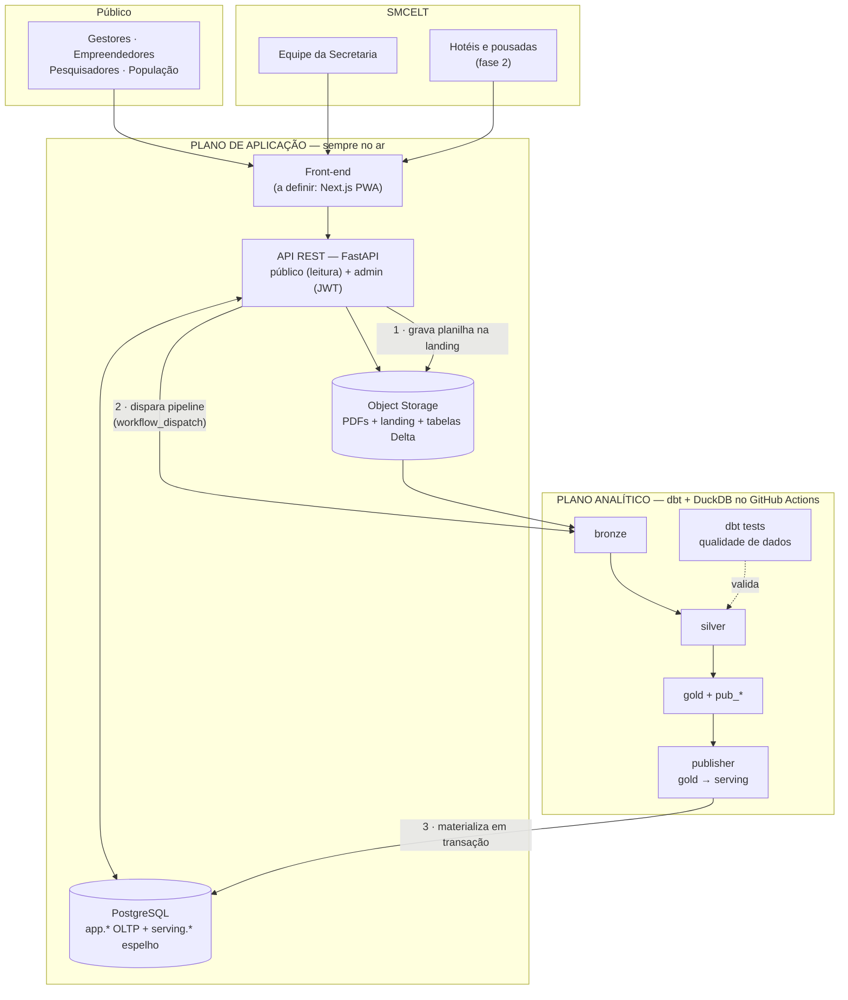

# Arquitetura — Plataforma Web do Observatório do Turismo de SRS (C317 / HEIComp 2026.2)

## Contexto

A SMCELT de Santa Rita do Sapucaí coleta dados turísticos (hospedagem, leitos, empresas,
empregos, fluxo de visitantes) de forma **manual e anual**, com baixo retorno dos
estabelecimentos, e guarda o resultado em **arquivos internos sem acesso público**. O
Observatório perde histórico a cada troca de gestão e os empreendedores não têm base para
planejar.

O projeto entrega, ao longo do semestre da C317, um **protótipo funcional de plataforma web**
que publica indicadores e relatórios de forma organizada, permite atualização contínua pela
Secretaria e — na fase 2 — aproxima a coleta dos próprios estabelecimentos.

Restrições que moldam o desenho:
- **Disciplina (C317)**: exige front-end + back-end + persistência; 8 milestones quinzenais
  seguindo o SDLC; a estrutura do projeto **não pode mudar bruscamente** depois de entregue a
  especificação (M2/M3). Milestones valem 70% da nota.
- **Equipe**: 4–5 alunos trabalhando em paralelo.
- **Front-end ainda indefinido** → arquitetura *contract-first*, agnóstica de front.
- **Stack de dados**: 100% open-source, sem custo recorrente e entregável à Prefeitura (§1).

### Premissas adotadas (revisáveis — as perguntas iniciais foram dispensadas)
| # | Decisão assumida | Alternativa se quiser trocar |
|---|---|---|
| 1 | Serving via **espelho em Postgres** (batch) | Consulta direta ao motor · export JSON estático |
| 2 | Back-end em **FastAPI (Python)** | NestJS/Node · Supabase puro |
| 3 | Entregar agora **docs de arquitetura + esqueleto do monorepo** | Só docs · docs + walking skeleton |
| 4 | Documentação em **PT-BR**, identificadores de código em inglês | PT-BR + artifact visual · tudo em inglês |

---

## 1. Decisão: motor analítico (ADR-001)

| Critério | **dbt + DuckDB** | Airflow + Spark + UC OSS + MinIO | Databricks Free Edition |
|---|---|---|---|
| Infra para operar | **zero (roda no CI)** | alta: scheduler, webserver, metadados, catálogo, object store | zero (gerenciado) |
| Custo real | **grátis** | exige VM (~US$ 5–20/mês) | grátis com quota |
| Risco para a demo final | **nenhum** | seu uptime é o seu problema | quota estourada derruba a compute pelo resto do dia |
| Licença p/ entrega à Prefeitura | **Apache/MIT ✓** | Apache ✓ | **não-comercial ✗** |
| Aderência ao volume (centenas/milhares de linhas) | **sob medida** | absurdamente sobredimensionado | sobredimensionado |
| Latência de consulta | **milissegundos** | n/a (não é runtime) | cold start de 10–30s |
| Curva p/ 4–5 alunos de graduação | **baixa** | alta | média |
| Artefato para milestone | **dbt docs: DAG de linhagem + testes** | UI de DAGs do Airflow | linhagem UC, AI/BI |

**Escolhido: dbt-duckdb**, escrevendo tabelas **Delta** (via `delta-rs`) em object storage para
preservar histórico e time travel — o objetivo de "preservar o histórico entre mudanças de gestão"
está no SRS e é atendido pelo formato de tabela, não pela marca do motor. Orquestração por cron do
GitHub Actions. Materialização final no Postgres de serving.

**Databricks Free Edition foi avaliado e descartado.** Registrar o porquê no ADR (é argumento de
banca, não desabafo):
- Termos de uso **acadêmico/não-comercial** — o SRS pede uma plataforma que a SMCELT **opere
  continuamente**; a licença não sustenta isso, e o projeto nasceria precisando de migração.
- Estourar a quota **derruba a compute pelo resto do dia** (em casos extremos, do mês) — risco
  direto no dia da apresentação final.
- Warehouse 2X-Small hiberna → **cold start de 10–30s**.
- **Saída de internet restrita a domínios confiáveis**: um job não consegue escrever em Postgres
  externo nem chamar a API — toda integração teria de ser invertida.
- **Databricks Apps não pode ser público** (sem acesso anônimo), logo jamais serviria o front.
- Sem SLA, suporte ou garantia de confiabilidade.

**Airflow e Unity Catalog OSS também ficam de fora**: para ~8 tarefas agendadas de 30 segundos, um
cron do GitHub Actions faz o mesmo trabalho sem servidor nenhum. Airflow só se paga com dezenas de
DAGs e dependências complexas; o UC OSS é um servidor de catálogo cujo ganho aparece com múltiplas
engines e RBAC entre times. Se quiser um orquestrador com UI para portfólio, **Dagster OSS** entrega
mais que Airflow com menos operação — mas é opcional aqui.

> **A troca custa quase nada**: o motor fica isolado atrás de um contrato (`pub_*` → publisher →
> `serving.*`). Trocar dbt-duckdb por qualquer outro motor é alterar **um** componente; a aplicação
> web não sabe quem gerou o dado. É a garantia arquitetural que torna a decisão reversível.

---

## 2. Princípio central

> **O plano analítico é o cérebro, nunca o runtime do site.**
> Ele processa, versiona e publica marts. A aplicação lê de um espelho barato e rápido.

Consequências: latência pública de ~20ms · falha do pipeline não derruba o site · o site continua
no ar servindo a última versão publicada, sempre.

---

## 3. Visão de containers (C4 nível 2)



As três setas numeradas são as **únicas** integrações entre os planos.

---

## 4. Plano de aplicação

| Componente | Escolha | Papel |
|---|---|---|
| Front-end | **Next.js (PWA)** — decisão adiada | Atende "Web e/ou Mobile ou PWA" com um único código |
| API | **FastAPI + Pydantic + SQLAlchemy** | Leitura pública + rotas admin autenticadas; OpenAPI vira documento de milestone |
| Banco | **PostgreSQL** (Supabase/Neon free) | `app` (OLTP) e `serving` (espelho do gold, leitura) |
| Storage | Supabase Storage / Cloudflare R2 | PDFs dos relatórios, landing de uploads e tabelas Delta |
| Auth | JWT + Argon2 (ou Supabase Auth) | **Só o admin autentica**; consulta pública é anônima |
| Pipeline | **dbt-duckdb** em GitHub Actions (cron + on-demand) | bronze→silver→gold, testes, docs |

**Separação de schemas é intencional**: `serving.*` é sempre reconstruível a partir do pipeline;
`app.*` é a fonte da verdade transacional (usuários, uploads, submissões, fila de validação,
auditoria). Nunca se misturam.

---

## 5. Plano analítico (medalhão)

- **Bronze** — cópia fiel do arquivo recebido + metadados (`_arquivo`, `_hash`, `_ingerido_em`,
  `_upload_id`). Nunca sofre correção: reprocessar é sempre possível.
- **Silver** — tipado, deduplicado, conformado: períodos normalizados, setor mapeado por CNAE,
  estabelecimento resolvido por CNPJ. **dbt tests** como qualidade declarativa (não negativo,
  ocupação ≤ 100%, período existente, unicidade de chave) com quarentena dos reprovados.
- **Gold** — modelo dimensional + camada de publicação que casa 1:1 com o contrato da API.

Fatos e dimensões:
`dim_periodo` · `dim_setor` · `dim_estabelecimento` · `fct_hospedagem_mensal` ·
`fct_emprego_setor` · `fct_empresas_setor` · `fct_fluxo_visitantes`

**Camada de publicação — a peça-chave:**

```
pub_indicador      (indicador_id, nome, unidade, descricao, fonte, metodologia, periodicidade)
pub_serie          (indicador_id, periodo, setor, valor, fonte, atualizado_em)  -- formato longo
pub_resumo_cards   (indicador_id, valor_atual, variacao_pct, periodo_ref)
pub_relatorio      (id, numero, ano, titulo, resumo, tags, url_pdf)
pub_versao         (versao, gerado_em, linhas, checksum)                        -- controle de sync
```

`pub_serie` em **formato longo** é o que torna API e front genéricos: adicionar um indicador novo
vira uma linha em `pub_indicador` + o cálculo no gold, **sem tocar em back-end nem front-end**.
Isso entrega os filtros por período e setor (funcionalidade #4) com um único endpoint e evita a
"mudança brusca de estrutura" que o professor proíbe após o M3.

Tudo versionado em git; `dbt docs` gera o grafo de linhagem — anexo pronto para o Milestone 3.

---

## 6. Fluxos principais

**A. Publicação de dados pela SMCELT** (funcionalidade #5, o coração do "atualização contínua"):

```
Upload da planilha (admin) → validação de schema/regras na API → app.upload (rascunho)
  → arquivo gravado na landing → dispara pipeline (workflow_dispatch do GH Actions)
  → bronze→silver→gold + dbt tests → bump de pub_versao
  → publisher materializa serving.* (transação) → site atualizado
  → status do run visível no painel admin (sucesso/falha + linhas rejeitadas)
```
Estados: `rascunho → em_revisao → publicado` (ou `rejeitado`), com trilha de auditoria — quem
publicou, quando, a partir de qual arquivo. É isso que garante o histórico entre gestões.

**B. Coleta autônoma pelos estabelecimentos** (fase 2, funcionalidade #6): formulário público com
token por estabelecimento → `app.submissao` → **fila de validação da SMCELT** → aprovado entra no
próximo ciclo. Nunca publica direto.

**C. Consulta pública**: browser → API → `serving.*`. Todo gráfico expõe "fonte" e "última
atualização" — transparência de dado público e credibilidade para gestores e pesquisadores.

---

## 7. Contrato de API (contract-first — front pode ser decidido depois)

```
GET  /api/v1/indicadores                       catálogo de indicadores
GET  /api/v1/series?indicador=&de=&ate=&setor= série temporal filtrada
GET  /api/v1/dashboard/resumo                  cards do dashboard
GET  /api/v1/relatorios?ano=&tag=              lista de relatórios
GET  /api/v1/relatorios/{id}/download          redirect p/ URL assinada do PDF
GET  /api/v1/inventario                        módulo PIT (fase 2)
GET  /api/v1/meta/atualizacao                  versão/data da última publicação
POST /api/v1/coletas                           autopreenchimento (fase 2)
POST /api/v1/admin/uploads                     envio de planilha
POST /api/v1/admin/uploads/{id}/publicar       dispara pipeline + publicação
GET  /api/v1/admin/execucoes                   status dos runs do pipeline
```

O OpenAPI gerado pelo FastAPI **é** o contrato entre a dupla de front e a de back — e anexo do M3.

---

## 8. Estrutura do repositório

```
/apps/web/          front-end (definido depois; contrato já congelado)
/apps/api/          FastAPI — routers/ services/ models/ migrations/
/data/              projeto dbt-duckdb: models/bronze|silver|gold, tests/, macros/
/data/publish/      publisher: materialização gold → Postgres serving
/docs/              srs.md · arquitetura (C4) · modelo-dados.md
                    adr/ (ADR-001 motor analítico, ...) · runbook.md · milestones/
/.github/workflows/ ci.yml · pipeline.yml (cron + workflow_dispatch)
```

---

## 9. Governança, LGPD e continuidade

- **LGPD**: nenhum dado pessoal no plano analítico. Dados de FNRH/hóspedes **não são ingeridos** —
  a plataforma só orienta sobre o sistema federal (funcionalidade #7). Submissões de
  estabelecimentos são agregadas; contato do responsável fica só em `app.*` com acesso restrito.
- **Dado aberto**: licença CC BY 4.0, download em CSV/JSON por gráfico, fonte e metodologia
  declaradas por indicador.
- **Continuidade entre gestões** (objetivo explícito do SRS): pipelines, schema, infra e runbook
  todos em git. Nada depende de um servidor montado na mão por alguém que saiu.
- **Entrega à Prefeitura**: stack inteiramente Apache/MIT — a SMCELT pode operar, auditar e evoluir
  sem impedimento de licença nem custo recorrente. Vale dizer isso na apresentação final.

---

## 10. Mapa dos milestones (70% da nota)

| MS | Etapa SDLC | Entrega |
|---|---|---|
| 1 | Planning | Escopo (5 essenciais + 3 desejáveis), papéis dos 4–5 alunos, riscos, cronograma |
| 2 | Analysis | SRS, casos de uso, personas dos 4 públicos, catálogo de indicadores, requisitos não-funcionais |
| 3 | Design | **Esta arquitetura**: C4, modelo dimensional, ER do OLTP, contrato OpenAPI, wireframes, ADRs |
| 4 | Implementação 1 | Pipeline bronze→silver→gold com dados reais dos relatórios do OT + API de leitura + serving |
| 5 | Implementação 2 | Front público: dashboard, filtros, relatórios em PDF |
| 6 | Implementação 3 | Painel admin: upload, validação, publicação, auditoria (+ fase 2 se couber) |
| 7 | Tests & Integration | pytest na API, dbt tests, Playwright E2E, teste de carga |
| 8 | Maintenance | Runbook, plano de evolução, handoff para a SMCELT |

**Divisão sugerida** (paralelismo desde o M4 graças ao contrato congelado no M3):
dados/dbt · back-end/API · front-end · UX + identidade visual (gradiente
`#0A4AAD → #6C5CE0 → #C750D6` e paleta de apoio do SRS) · integração/QA.

---

## 11. Riscos

| Risco | Mitigação |
|---|---|
| Dados históricos do OT existem só em PDF | M2 inclui digitalização dos relatórios publicados para uma série inicial real |
| Escopo da fase 2 estourar o semestre | Itens 6–8 são explicitamente opcionais no SRS; só entram após os 5 essenciais |
| Grupo travar esperando decisão de front | Contrato OpenAPI fechado no M3 desbloqueia back e dados imediatamente |
| Free tier de hospedagem hibernar a API | Health check periódico; o Postgres é o estado, o container é descartável |
| Baixo retorno dos estabelecimentos na fase 2 | Formulário curto com token, sem login; validação assíncrona pela SMCELT |
| Falha de pipeline publicar dado ruim | dbt tests bloqueiam a promoção; `pub_versao` só sobe com o build verde |

---

## 12. Spikes de validação (antes de fechar o M3)

1. **`delta-rs` grava Delta no object storage escolhido** (R2/Supabase) e o DuckDB lê de volta.
   Se não → Parquet particionado + snapshot versionado (mesma garantia de histórico, sem time travel).
2. **Materialização gold → Postgres em transação**, com rollback em falha e `pub_versao` consistente.
3. **`workflow_dispatch` disparado pela API** com token de escopo mínimo. Se não → cron a cada
   30 min e publicação assíncrona, avisada no painel admin.

---

## Verificação

- Spikes 1–3 executados, resultados anexados aos ADRs.
- `dbt build` verde: modelos + testes de qualidade; `dbt docs generate` produz o grafo de linhagem.
- API sobe local (`uvicorn`) e `/docs` renderiza o OpenAPI completo.
- Publicação ponta a ponta: upload de planilha fictícia → pipeline → `serving.*` → `GET
  /api/v1/series` retorna o dado novo e `/api/v1/meta/atualizacao` reflete a versão.
- **Teste de isolamento**: derrubar o plano analítico e confirmar que o site continua respondendo
  com a última versão publicada — é a propriedade central da arquitetura e vale demonstrar na banca.

---

## Próximos passos

1. Fechar com a equipe as premissas em aberto no topo deste documento (back-end, front-end,
   estratégia de serving).
2. Executar os spikes 1–3 do §12 e registrar cada resultado como ADR em `docs/adr/`.
3. Congelar o contrato da API do §7 no Milestone 3 — é o que libera front, back e dados para
   andarem em paralelo a partir do Milestone 4.
4. Criar o esqueleto do monorepo conforme o §8: `apps/api/` (FastAPI + OpenAPI),
   `data/` (projeto dbt-duckdb), `data/publish/` (publisher) e `.github/workflows/`.

## Diagramas

`docs/diagramas/Arquitetura_Observatorio_Turismo_SRS.drawio` — três páginas: visão de containers
(C4 nível 2), fluxo de publicação e camada de publicação + contrato da API. Abre em
[diagrams.net](https://app.diagrams.net) ou no VS Code com a extensão Draw.io Integration
(`hediet.vscode-drawio`).
